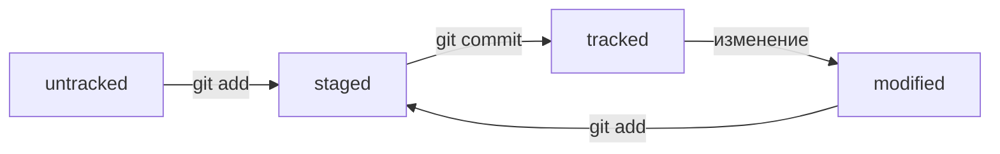

# Это первая практическая работа по курсу Git от Яндекс
## Расскажу про шпаргалку по Git
----
### Команды для работы в консоли
* pwd - Print work directory - вывод текущей директории
* cd ~ - переход к домашней директории
* touch - создание файла
* mkdir - создание директории
* cp - копирование файлов
* mv - перемещение файлов
* cat - просмотр текстовых файлов
* rm - удаление файла
* rmdir - удаление директории
* && - объединение команд (их последовательное выполнение)
* clip — копирует поток данных в буфер обмена
----
### Команды для работы с Git в консоли
* git init   - инициализация директории как репозторий
* git status - информация о репозитории
* git add (--all) - запомнить файл (все файлы). Надо выполнять после внесения изменений
* git commit - выполнить коммит
* git log - журнал изменений
* git remote add (псевдоним адрес_репозитория) - добавления связи с удалённым репозитарием
* git remote -v - вывод информации о связанном репоритории
* git push - выгрузка на репозиторий

## Дополнительная информация
### Хэш
Хэш - это идентификатор коммита. По нему можно однозначно идентифицировать определённый коммит. Считается по алгоритму SHA-1

### Лог
Лог содержит информацию о коммитах - хеш, дату, автора и сообщение. Для вывода лога используется команда

```
git log
```

Также возможен вывод сокращённого лога с первыми 72 символами сообщения и сокращённым хэшем. Для этого используется команда

```
git log --oneline
```

### HEAD
HEAD - это указатель на последний залитый коммит. Его можно использовать в командах git вместо хеша. Информация о том, какой коммит является 
головным содежится в файле, расположенном в папке .git

### Жизненный цикл файла
Статусы файлов в Git

